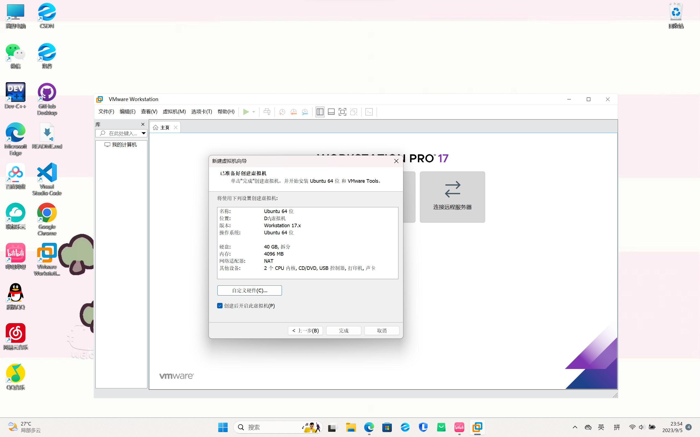

# *3.虚拟机*
                   ————from 2023级 2023090908027文雯
***
## 我选择的是分支2

 话说我是暑假装的ubuntu,真哩没有截图，只有我看到题干要求现截的嘞。
 - 
 - 
 - 
 ***
## 加分项的完成：
+ 1、已用VScode的Remote插件连接至我的虚拟机并且看了一些关于xshell的科普视频
   + 
  
+ 2、配置好了基于SSH密匙的免密的远程服务器登录（话说这个需要怎么证明？？）

+ 3、另外，我还修改了虚拟机十几分钟就要自动休眠断开连接的默认,还安装了vim。
  ***
## 个人感想及文字说明
 此外，我对这道题真的有很多~~艰辛~~想要诉说：
 
 ~~我要按照顺序一个个来~~
  
  - First , 明明下的是*17*的VM，电脑在安装的时候应用商店默认16，我？？？
  
  - Second , 在分配虚拟机磁盘，内存和内核数这个问题上我纠结了很久，网上真的众说纷纭，我？？？
  
  - Third , 装好完整ubuntu就第二天，我开始了解WSL了，对内存爱惜至极的我真的很馋它的轻便啊，而且对于现阶段的我来说不需要用VM那么高的配置，我甚至想过卸了改WSL，我？？？
  
      不过后来经过了解，WSL确实也存在挺多问题，用户体验不如完整虚拟机，好耶好耶
  
  - Fourth , 感觉过了挺多天的，我开始学习用**VScode远程连接Linux** 了, emm,第一步，*安装Remote插件*，emm，这个我会我会，好呀好呀。直接看下一步：*粘贴ip地址*......等一下，我有问题，ip地址怎么查看？是需要Windows的还是Linux的？然后通过尝试，我终于知道~~那个cool的黑框框~~terminal是怎么来的了。总之，经过我一系列的操作，我终于来到了教程里的最后一步，我怀揣了激动的心情按下回车，但是却显示无法连接，试了几次都不行，我哭哭，呜呜~~
   
    没有办法，远程连接虚拟机是必须的，我按捺下浮躁的心，再重新仔细复盘了下每一步，发现了*两个*可能问题：

       1. 我的Windows的IP地址为113开头，和虚拟机**192**开头的IP很明显不在同一个网段，经过查阅，我了解到：

          1. 这样会导致主机和虚拟机不能*ping通*，什么防火墙，桥接，nat,手动修改IP地址等等建议的解决方案和可能原因看得我脑袋晕晕
          2. 113.xxx.xxx很明显是一个失效地址，可能原因：我当时在图书馆进行的如上操作，图书馆由于人流量大，可能有效的IP地址已经分配完了

      2. 我的Linux可能没有安装ssh,必须通过终端安装`openssh-server`

    综上所述，我决定回寝室！
    
    ~~只是顺便买了杯蜜雪冰城诶~~

    结果不出所料，我一回到温暖的寝室，Windows的IP就变成了**192.xxx.xxx**，我差点喜极而泣，接下来的就顺理成章了，给Linux安装好ssh后，我终于成功了！！！

